# PulseBoard

**A real-time project board for engineering teams.** Node.js/Express API, MongoDB,
Socket.IO for live collaboration and a React frontend, with an AI assistant that
summarizes discussion threads, writes sprint reports and suggests priority changes.


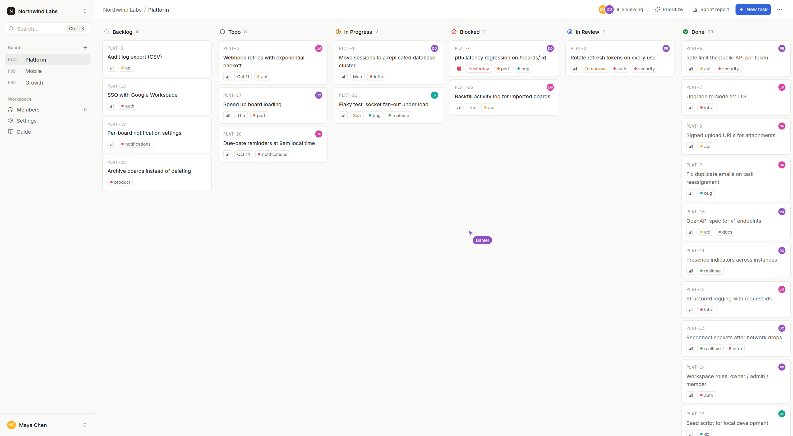

## Contents

- [Overview](#overview)
- [Live demo](#live-demo)
- [Screenshots](#screenshots)
- [Highlights](#highlights)
- [Tech stack](#tech-stack)
- [Architecture notes](#architecture-notes)
- [Project structure](#project-structure)
- [Getting started](#getting-started)
- [Tests](#tests)
- [API documentation](#api-documentation)
- [Author](#author)

## Overview

PulseBoard is a Kanban-style board for tracking work across teams and projects. Cards
move through a defined workflow, changes reach every connected client instantly over
WebSockets, and everything (from role permissions to workflow transitions) is enforced
on the server, not just hidden in the UI.

```
Frontend/   React 19 + Vite + Tailwind CSS 4, Radix UI primitives, TanStack Query
Backend/    Node.js + Express 5, MongoDB (Mongoose), Socket.IO, Zod validation
```

## Live demo

The app ships with a guided demo that needs no sign-up. Visitors pick a role on `/demo`
and land in **Margalla Labs**, a six-person product team in Islamabad with three boards
(Platform, Mobile App, Payments), a few weeks of history and working AI features.

<table>
  <tr>
    <td width="50%">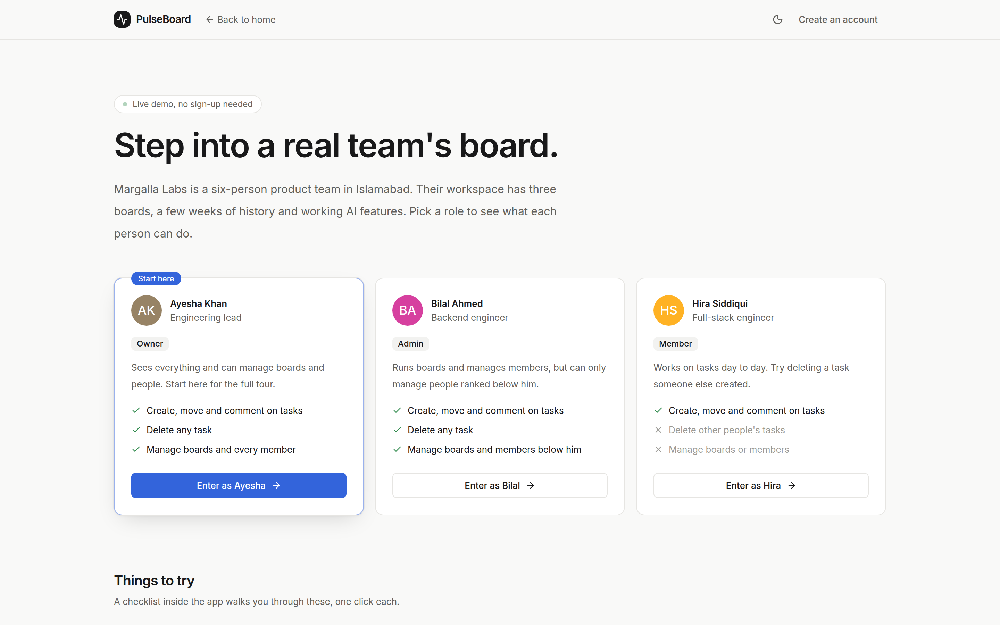</td>
    <td width="50%">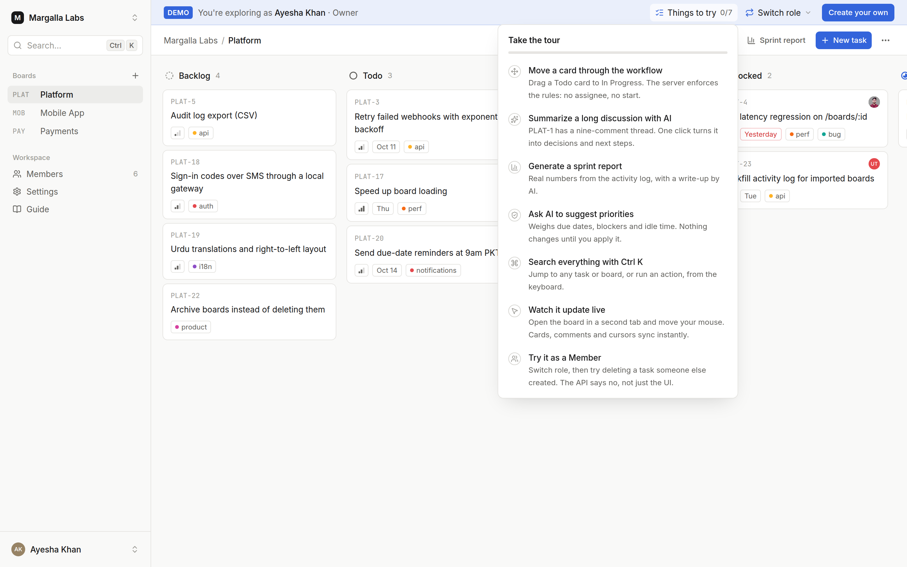</td>
  </tr>
  <tr>
    <td><b>Pick a role.</b> Owner, admin or member, each with what they can and can't do.</td>
    <td><b>Guided tour.</b> A banner shows who you are, switches roles in one click and walks through seven things to try.</td>
  </tr>
</table>

Demo mode is built so a public demo stays usable for the next visitor:

- **Shared accounts, real permissions.** Demo users are normal accounts with a demo flag
  carried in their access token. Role checks work exactly as they do for real users.
- **Destructive actions are locked server-side.** Deleting or renaming workspaces and
  boards, changing members, uploading files and deleting the seeded tasks return
  `403 demo_locked`. Tasks and comments a visitor adds can still be edited and deleted.
- **No email to demo accounts**, and a daily per-visitor cap on AI requests.
- **Resetting is safe on a live server.** `npm run demo:reset` rebuilds only the demo
  workspace and leaves real users alone. Set `DEMO_RESET_HOURS` to reset it on a timer.

## Screenshots

<table>
  <tr>
    <td width="50%">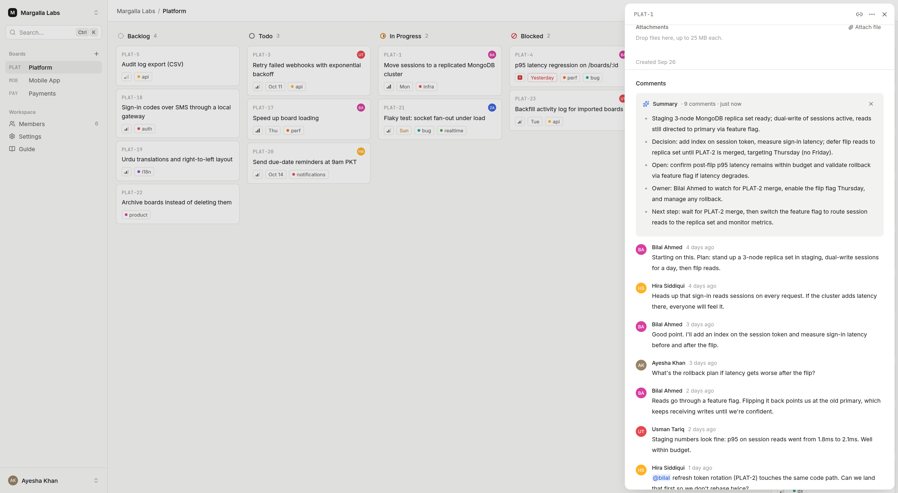</td>
    <td width="50%">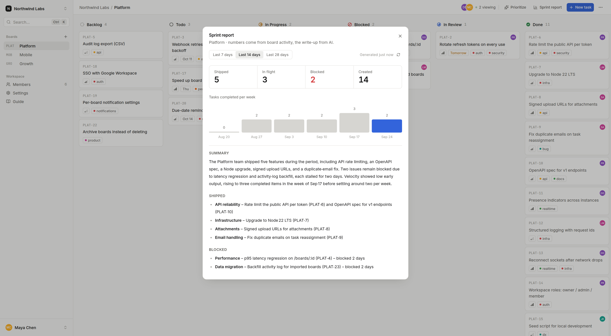</td>
  </tr>
  <tr>
    <td><b>Task panel.</b> Properties, dependencies, attachments and the comment thread, with a one-click AI summary of the discussion.</td>
    <td><b>Sprint report.</b> Shipped, in flight, blocked and weekly velocity are computed from the activity log; the AI only writes the summary.</td>
  </tr>
  <tr>
    <td>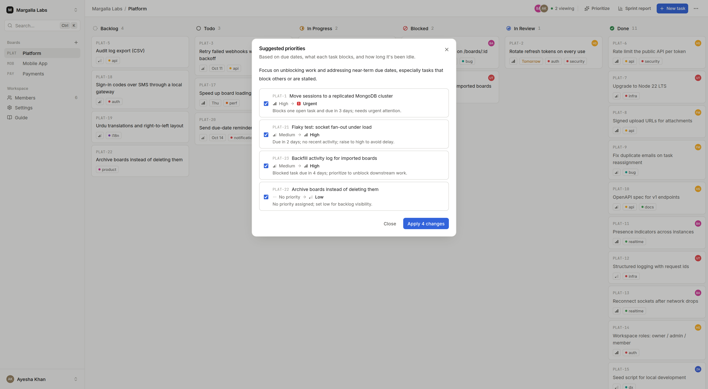</td>
    <td>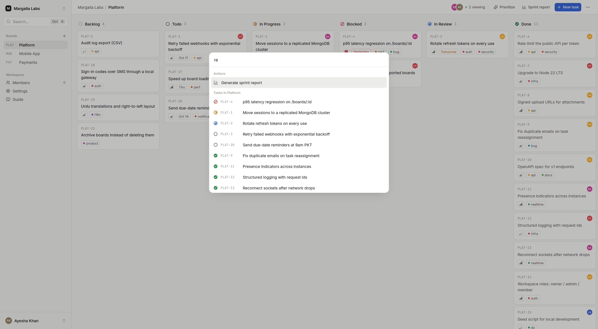</td>
  </tr>
  <tr>
    <td><b>Suggested priorities.</b> Based on due dates, what each task blocks and how long it's been idle. Nothing changes until you apply it.</td>
    <td><b>Command palette.</b> <code>Ctrl K</code> jumps to any task or board and runs actions without leaving the keyboard.</td>
  </tr>
  <tr>
    <td>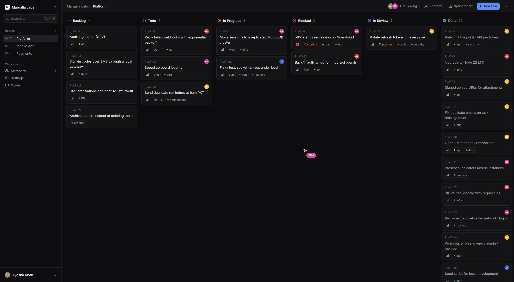</td>
    <td>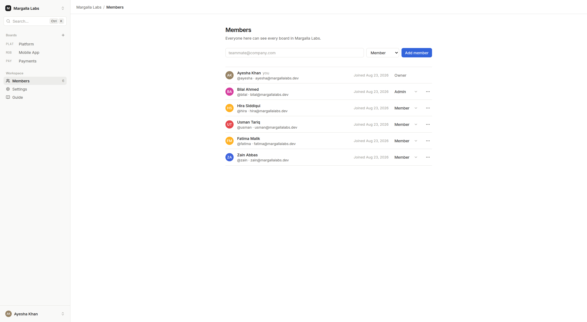</td>
  </tr>
  <tr>
    <td><b>Dark mode</b>, with all six workflow columns.</td>
    <td><b>Members and roles.</b> Owners, admins and members, with rank-based rules for who can manage whom.</td>
  </tr>
  <tr>
    <td>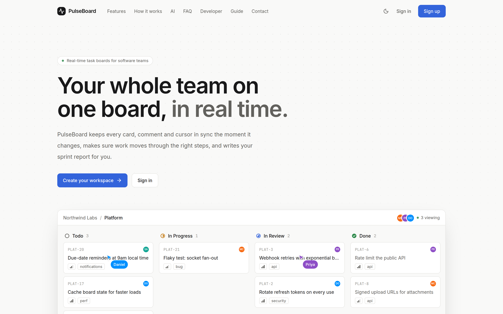</td>
    <td>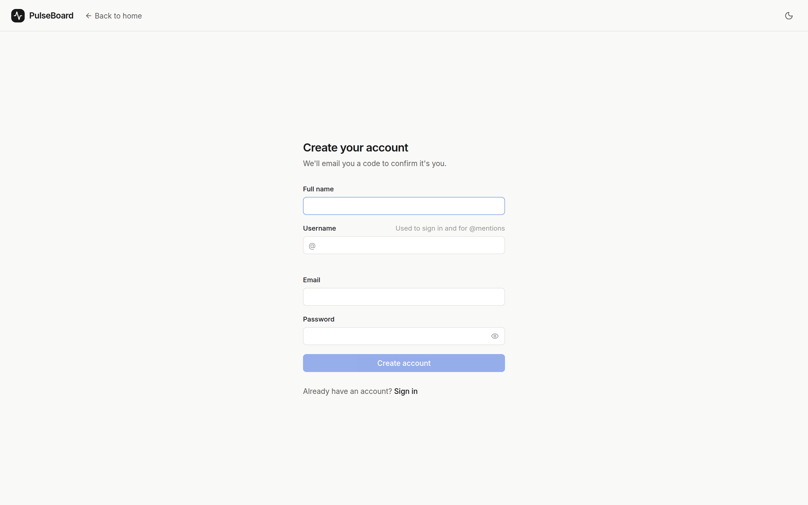</td>
  </tr>
  <tr>
    <td><b>Landing page</b> with an animated preview of a live board.</td>
    <td><b>Sign-up</b> with a live username availability check and email verification by code.</td>
  </tr>
</table>

## Highlights

- **Live collaboration.** Every card move, edit and comment is pushed to connected
  clients over Socket.IO. No polling, no refresh. Presence indicators and live cursors
  show who's on a board right now, and people who lose access are disconnected from the
  board immediately.
- **Enforced workflow.** Task status transitions follow a fixed state machine on the
  server: a task can't start without an assignee, can't finish with open dependencies,
  and illegal moves are rejected by the API, not just disabled in the UI.
- **Role-based access control.** Owner / Admin / Member roles are checked on every API
  call and every socket connection, with rank-based rules governing who can manage whom.
- **Secure authentication.** Email verification with one-time codes, short-lived JWT
  access tokens, rotating refresh tokens in an httpOnly cookie, and reuse detection that
  revokes an entire session family if a stale token is replayed.
- **AI-assisted reporting** that stays trustworthy: sprint report metrics (velocity,
  throughput, blocked items) are always computed directly from the database. The
  language model only writes the narrative around real numbers, and structured
  suggestions are validated against a schema before they're shown.
- **File attachments** via presigned uploads to any S3-compatible object store.
- **Transactional email** for account verification, password resets, assignment
  notifications, mentions and due-date reminders.
- **Documented REST API** (OpenAPI 3.1, served at `/docs`) alongside a Socket.IO event
  contract.
- **Public demo mode** with one-click sign-in per role, a guided checklist and
  server-side protection against visitors breaking it (see [Live demo](#live-demo)).
- **Keyboard-first UX**: a command palette (`⌘K` / `Ctrl+K`), single-key shortcuts and
  full dark mode.

## Tech stack

| | |
|---|---|
| **Backend** | Node.js, Express 5, MongoDB/Mongoose, Socket.IO, Zod, JWT, bcrypt, Pino |
| **Frontend** | React 19, Vite, Tailwind CSS 4, Radix UI, TanStack Query, react-router, dnd-kit |
| **AI** | Thread summaries and structured suggestions via an OpenAI-compatible chat API |
| **Storage** | S3-compatible object storage (presigned uploads/downloads) |
| **Email** | SMTP via Nodemailer |
| **Testing** | Vitest, Supertest, socket.io-client |

## Architecture notes

Both apps are organized **by feature**, not by technical layer: `features/tasks`,
`features/boards`, `features/workspaces` and so on each own their models, routes and
business logic end to end, rather than being split across generic `controllers/`,
`models/`, `services/` folders.

**Realtime.** Each board is a Socket.IO room. Services broadcast a change only after the
database write succeeds, and presence is derived from the sockets currently in the room,
so there's no separate presence list to fall out of sync. Cursor positions are sent as
volatile messages: a slow client drops stale frames instead of building a backlog. After
a reconnect the client refetches the board, so missed events can't leave it stale.

**Rate limiting** uses a sliding-window counter kept in memory: one pair of numbers per
client per window, weighting the previous window by how much of it still overlaps the
current one. It was chosen over a fixed window (which lets a client burst to 2× the
limit across a boundary) and a sliding log (exact, but stores every request timestamp)
as the right accuracy-to-cost tradeoff for abuse protection rather than precise billing.
Limits: 10 req/min per IP on auth endpoints, 300 req/min per user on the general API,
20 req/min per user on AI endpoints.

**Data integrity in the workflow engine.** Status transitions are defined as an
explicit graph on the server (e.g. a task can only leave `blocked` for `todo` or
`in_progress`), and two invariants are enforced on every transition: a task cannot enter
`in_progress` without an assignee, and cannot enter `in_progress` or `done` while it has
open dependencies. Circular dependencies are rejected when they're created.

**Ordering without rewrites.** Cards use fractional positions, so moving a card only
updates that one document instead of renumbering the whole column.

## Project structure

```
Backend/src/
  features/         auth, workspaces, boards, tasks, comments, attachments,
                    activity, notifications, ai, contact
  realtime/         Socket.IO server, rooms and presence
  services/         email, S3 storage, AI provider
  middleware/       auth, rate limiting
  features/demo/    demo accounts, sign-in, guards and seed data
  scripts/          seed (local reset) and demo:reset (safe in production)

Frontend/src/
  features/         one folder per area of the app (boards, tasks, ai, auth, ...)
  components/       shared UI: buttons, dialogs, menus, avatars
  lib/              API client, socket, theme, hotkeys
```

## Getting started

**Requirements:** Node.js 20.11+, MongoDB (local instance or a hosted connection
string).

```bash
# 1. API
cd Backend
cp .env.example .env      # configure MONGO_URL and JWT_ACCESS_SECRET at minimum
npm install
npm run seed              # optional: wipes the local DB and loads the demo workspace
npm run dev               # http://localhost:4000, API docs at /docs

# 2. Web app (separate terminal)
cd Frontend
npm install
npm run dev               # http://localhost:5173
```

After seeding, open http://localhost:5173/demo and pick a role, or sign in as `ayesha`
(owner), `azan` (admin) or `hira` (member) with the password `pulseboard`. Open the same
board in two browsers as different people to see live updates, presence and cursors.

On a deployed server, use `npm run demo:reset` instead of `npm run seed`: it creates or
rebuilds the demo without touching anyone else's data.

Optional integrations are enabled independently via environment variables. See
`Backend/.env.example` for the full list:

- **AI features**: set `NVIDIA_API_KEY` (or point `NVIDIA_BASE_URL` at any
  OpenAI-compatible endpoint) to enable thread summaries, sprint reports and priority
  suggestions. Without it, those panels report that AI is disabled and the rest of the
  app is unaffected.
- **File attachments**: set the `S3_*` variables to point at an S3-compatible bucket.
- **Email**: set `GMAIL_USER` / `GMAIL_APP_PASSWORD` (or adapt `services/email.js` for
  another provider). Without it, outbound email is logged to the console instead of
  sent, so local development doesn't require a mail account.

## Tests

```bash
cd Backend
npm test
```

Covers authentication flows, role-based access control enforced through the real HTTP
API, workflow transition rules, sprint-velocity calculations, rate-limit accuracy and
live Socket.IO events (presence, broadcasts, and removing people who lose access) and
the demo mode guards. The
API suites require a running MongoDB instance.

## API documentation

The full REST API is documented with OpenAPI 3.1 and served at `/docs` (Swagger UI)
once the backend is running, with the raw spec available at `/openapi.json`.

## Author


**Azan Imtiaz**, Software Engineer · Rawalpindi, Pakistan
Software Engineering graduate (Arid University, 2025). I work as a blockchain developer
and build Node.js/Express backends with role-based access control and LLM features.

[GitHub](https://github.com/Azan-imtiaz) ·
[LinkedIn](https://www.linkedin.com/in/azan-imtiaz/) ·
[YouTube](https://www.youtube.com/@codingwithazan2280) ·
[Email](mailto:azanimtiaz150@gmail.com)

<br clear="left" />
